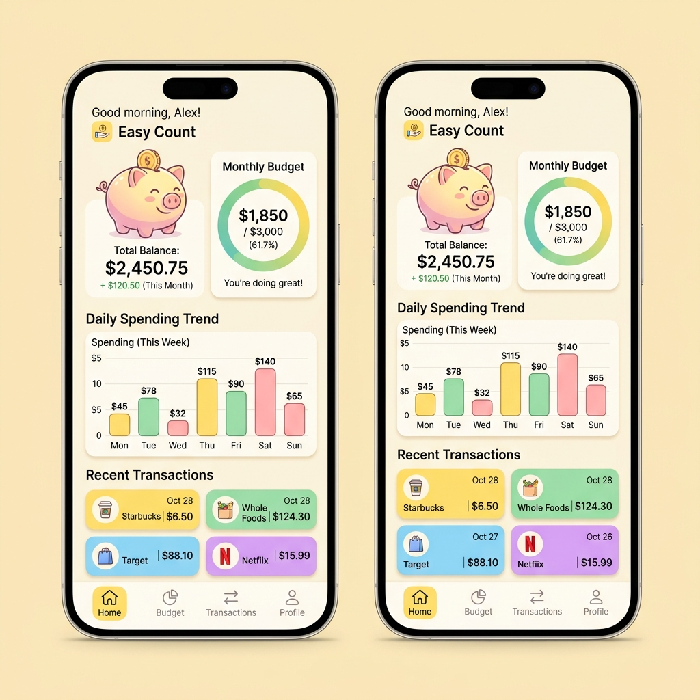

# 🐷 Easy Count - Piggy Advisor Money Concierge

Easy Count is a cute, pastel-themed money management app designed to make bookkeeping intuitive, gamified, and delightful.

<p align="center">
  
</p>

## 💡 The Problem & Mission
Traditional personal finance apps feel dry, serious, and full of complex tables, making tracking expenses a stressful chore. **Easy Count** transforms monthly bookkeeping into a cute, visual experience. By combining high-contrast visual status cards, circular budget progress rings, and daily trend bar charts with the friendly **Piggy Advisor** AI concierge, it removes the dread/anxiety of monthly bookkeeping and guides you to healthy saving habits.

## 🤖 Piggy Advisor AI Agent
The Piggy Advisor is a friendly, secure, and cute chatbot integrated directly into the dashboard. Powered by the Gemini ADK engine, it can:
- Parse natural language inputs with dynamic relative date recognition (e.g., resolving "yesterday", "today", "tomorrow" based on current server time).
- Mask potential PII (emails, phone numbers) automatically before database storage.
- Provide custom spending summaries and monthly budget audits.
- Offer smart saving advice by reviewing your historical spending trends.

## Project Structure

```
money-management-agent/
├── app/         # Core agent code
│   ├── agent.py               # Main agent logic
│   └── app_utils/             # App utilities and helpers
├── tests/                     # Unit, integration, and load tests
├── GEMINI.md                  # AI-assisted development guide
└── pyproject.toml             # Project dependencies
```

> 💡 **Tip:** Use [Gemini CLI](https://github.com/google-gemini/gemini-cli) for AI-assisted development - project context is pre-configured in `GEMINI.md`.

## Requirements

Before you begin, ensure you have:
- **uv**: Python package manager (used for all dependency management in this project) - [Install](https://docs.astral.sh/uv/getting-started/installation/) ([add packages](https://docs.astral.sh/uv/concepts/dependencies/) with `uv add <package>`)
- **agents-cli**: Agents CLI - Install with `uv tool install google-agents-cli`
- **Google Cloud SDK**: For GCP services - [Install](https://cloud.google.com/sdk/docs/install)


## Quick Start

Install `agents-cli` and its skills if not already installed:

```bash
uvx google-agents-cli setup
```

Install required packages:

```bash
agents-cli install
```

Test the agent with a local web server:

```bash
agents-cli playground
```

You can also use features from the [ADK](https://adk.dev/) CLI with `uv run adk`.

## 🐷 Demo Scenarios Importer

To make it easy to test features like Piggy Advisor analysis or the visual category and daily trend charts, you can populate the database with realistic demo scenarios directly from your terminal:

* **balanced**: Budget set to $2000.00 and 29 realistic transactions totaling $1975.90 for June 2026 (balanced).
* **overbudget**: Budget set to $1500.00 and 12 luxury transactions totaling $2225.00 for June 2026 (over budget limit).
* **current**: Appends initial draft transactions for July 2026.
* **clear**: Erases all database budget limits and transaction records.

Run the import script using `uv`:

```bash
# Load balanced June 2026 scenario
uv run python scripts/import_demo.py --scenario balanced

# Load overbudget June 2026 scenario
uv run python scripts/import_demo.py --scenario overbudget

# Clear database
uv run python scripts/import_demo.py --scenario clear
```

## Commands

| Command              | Description                                                                                 |
| -------------------- | ------------------------------------------------------------------------------------------- |
| `agents-cli install` | Install dependencies using uv                                                         |
| `agents-cli playground` | Launch local development environment                                                  |
| `agents-cli lint`    | Run code quality checks                                                               |
| `agents-cli eval`    | Evaluate agent behavior (generate, grade, analyze, and more — see `agents-cli eval --help`) |
| `uv run pytest tests/unit tests/integration` | Run unit and integration tests                                                        |

## 🛠️ Project Management

| Command | What It Does |
|---------|--------------|
| `agents-cli scaffold enhance` | Add CI/CD pipelines and Terraform infrastructure |
| `agents-cli infra cicd` | One-command setup of entire CI/CD pipeline + infrastructure |
| `agents-cli scaffold upgrade` | Auto-upgrade to latest version while preserving customizations |

---

## Development

Edit your agent logic in `app/agent.py` and test with `agents-cli playground` - it auto-reloads on save.

## Deployment

```bash
gcloud config set project <your-project-id>
agents-cli deploy
```

To add CI/CD and Terraform, run `agents-cli scaffold enhance`.
To set up your production infrastructure, run `agents-cli infra cicd`.

## Observability

Built-in telemetry exports to Cloud Trace, BigQuery, and Cloud Logging.
